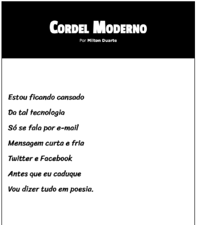
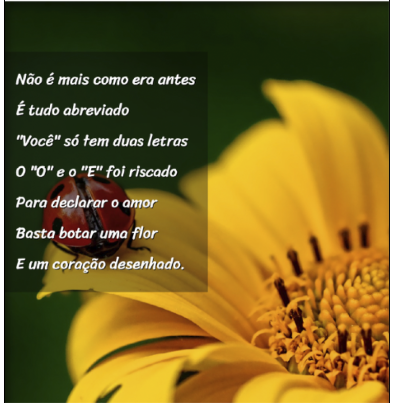
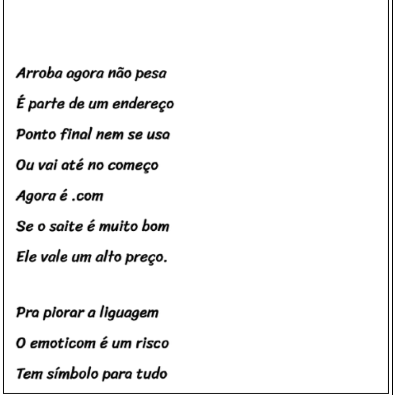

# Projeto Cordel - Curso em Vídeo

   

<h4 align="center"> 
📚 Projeto Cordel 📖 
</h4>

	 

 <a href="#sobre">Sobre</a> •
 <a href="#efeitos-visuais">Efeitos Visuais</a> •
 <a href="#tecnologias">tecnologias</a>  

## 💻 Sobre o projeto

📚 Projeto Cordel - Nesse desafio, transformei uma
poesia em um site, incluindo efeitos de
parallax nas imagens aplicadas ao fundo
da página. Ínclui as fontes Passion One
e Sriracha disponíveis no Google Fonts
para que eu pudesse utilizar nesse projeto.
Organizei o conteúdo para que duas
estrofes (a segunda e a quinta) sejam
apresentadas dentro de uma área com
uma imagem fixa no fundo. Adicionei o
efeito parallax nessa imagem, onde o
conteúdo apresenta uma rolagem e a
imagem fique fixa no fundo.
Esse projeto exigiu conhecimento
básico das propriedades de imagens que
foram aprendidas durante o curso.

## ⚙️ Efeitos Visuais

<h1 id='efeitos-visuais'></h1>
                         
- [x] Efeitos de parallax nas imagens  
- [x] Utilização de fontes do Google fonts 
- [x] Organização do conteúdo 
- [x] Imagens fixas na rolagem 
- [x] Responsividade 

## 🛠 Tecnologias

Para este projeto eu usei :	

